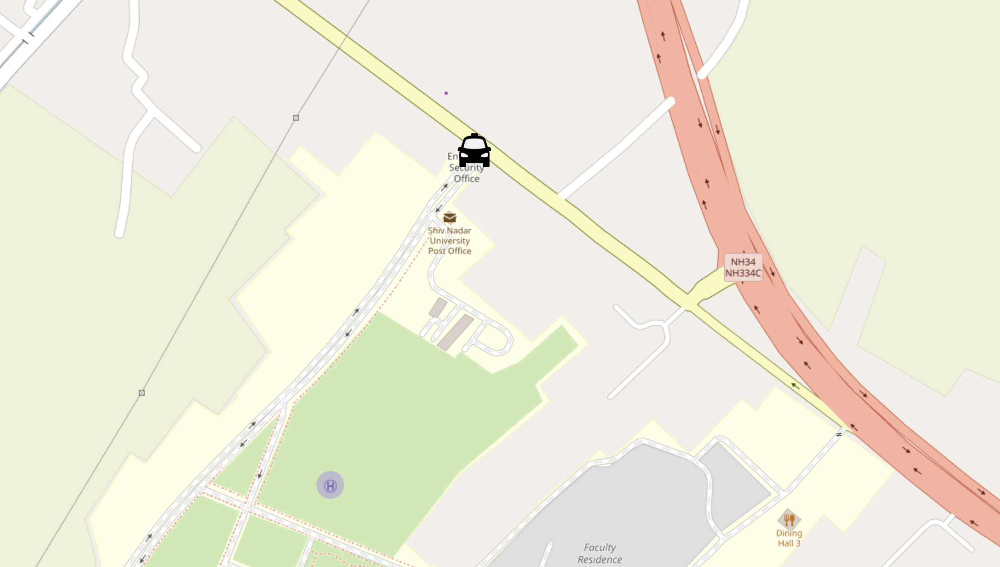
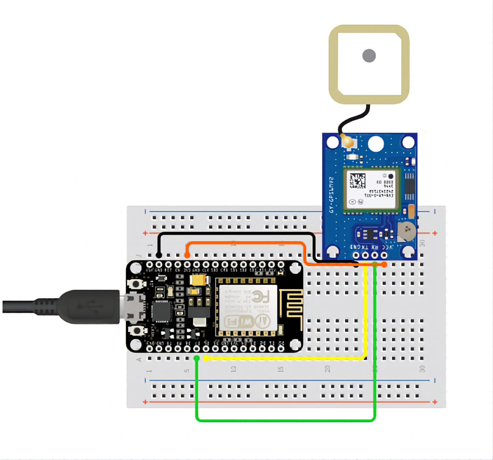

<h1 align="center">TrackWheels</h1>

  

<h2>Overview</h2>

TrackWheels is an ESP-based vehicle tracking system designed to monitor and display the real-time location of vehicles. This project consists of two main components: the hardware setup and the software for map visualization.

<h2>Hardware Setup</h2>

The hardware component of TrackWheels includes:

<ul>
    <li><strong>ESP8266 Development Board</strong>: A low-cost Wi-Fi microchip with full TCP/IP stack and microcontroller capability.</li>
    <li><strong>Neo6M GPS Module</strong>: A GPS module used to retrieve the geographical coordinates of the vehicle.</li>
</ul>

The ESP8266 board reads the GPS data from the Neo6M module and sends the vehicle coordinates to a Supabase cloud database.

<h2>Software</h2>

The software component is built using ReactJS and is responsible for displaying a map that tracks the real-time location of the vehicle. It collects the coordinates stored in the Supabase database and visualizes them on the map.

<h2>Installation and Setup</h2>

<h3>Hardware</h3>

  

<ol>
    <li><strong>Connect the ESP8266 to the Neo6M GPS Module</strong>:
        <ul>
            <li>VCC of Neo6M to 3.3V of ESP8266</li>
            <li>GND of Neo6M to GND of ESP8266</li>
            <li>TX of Neo6M to D1 of ESP8266</li>
        </ul>
    </li>
    <li><strong>Upload the firmware</strong>:
        
Use the Arduino IDE to write and upload the code to the ESP8266. The code should read the GPS data and send it to the Supabase database.

    </li>
    <li><strong>Supabase Setup</strong>:
        <ul>
            <li>Create a new project in Supabase.</li>
            <li>Set up a table to store the vehicle coordinates (latitude, longitude, timestamp).</li>        
          <pre><code>
            CREATE TABLE GPS (
            id SERIAL PRIMARY KEY,
            LAT FLOAT NOT NULL,
            LONG FLOAT NOT NULL,
            updated_at TIMESTAMP DEFAULT CURRENT_TIMESTAMP NOT NULL
            );
          </code></pre>
            <li>Note down the <code>supabaseUrl</code> and <code>supabaseAPIKey</code>.</li>
        </ul>
    </li>
</ol>

<h3>Software</h3>
<ol>
    <li><strong>Clone the repository</strong>:
        <pre><code>git clone https://github.com/VarunMusham/TrackWheels.git
cd TrackWheels
        </code></pre>
    </li>
    <li><strong>Install the dependencies</strong>:
        <pre><code>npm install
        </code></pre>
    </li>
    <li><strong>Add Supabase Credentials</strong>:
        
Add your credentials in TrackWheels.ino and Map.js files

    </li>
    <li><strong>Run the application</strong>:
        <pre><code>npm start
        </code></pre>
    </li>
    <li><strong>Open the application</strong>:
        
Navigate to <a href="http://localhost:3000">http://localhost:3000</a> in your web browser to see the map displaying the real-time location of the vehicle.

    </li>
</ol>

<h2>Usage</h2>
<ul>
    <li>Turn on the hardware setup.</li>
    <li>Ensure the ESP8266 is connected to a Wi-Fi network.</li>
    <li>Start the React application to view the real-time tracking on the map.</li>
    <li>You can extract other values from Neo 6M module. (refer datasheet).</li>
</ul>

<h2>Contributing</h2>

Contributions are welcome! Please fork the repository and create a pull request with your changes.

<h2>Deployment</h2>

You can deploy the Map website using services like Vercel, Netlify and many more. Make sure to select correct framework while deploying

